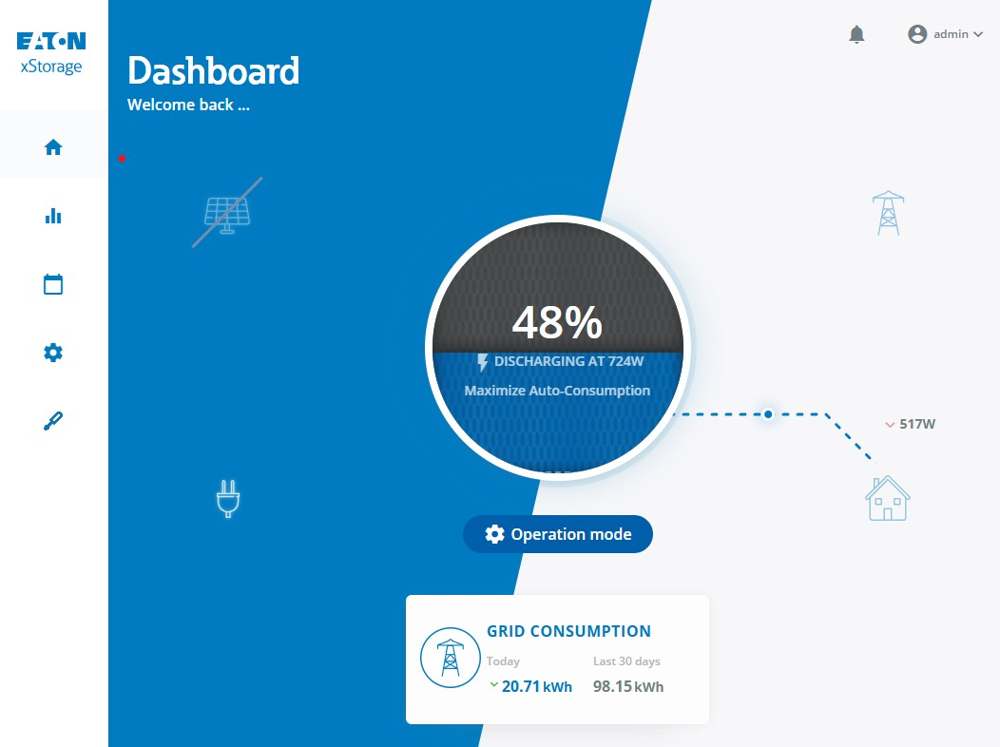
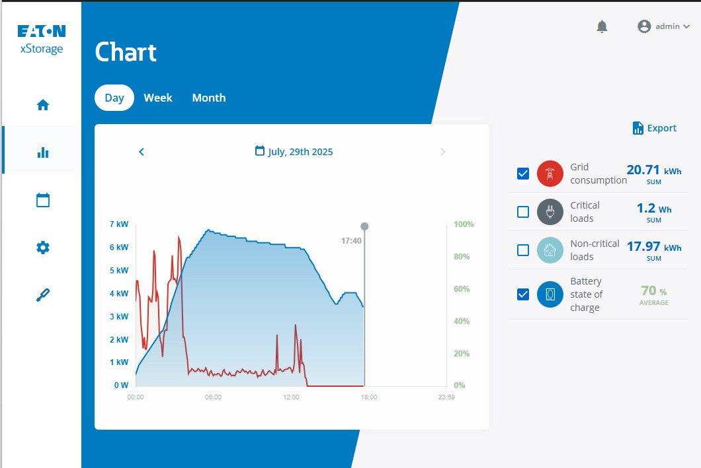
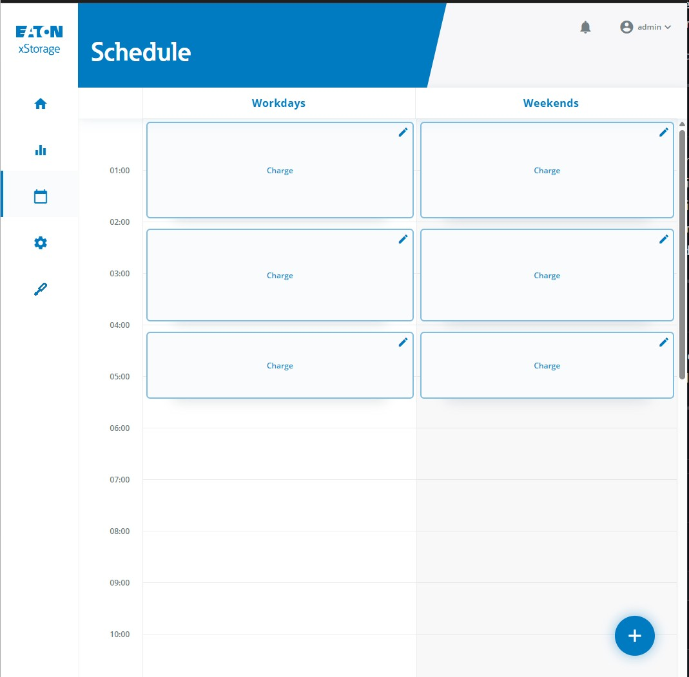
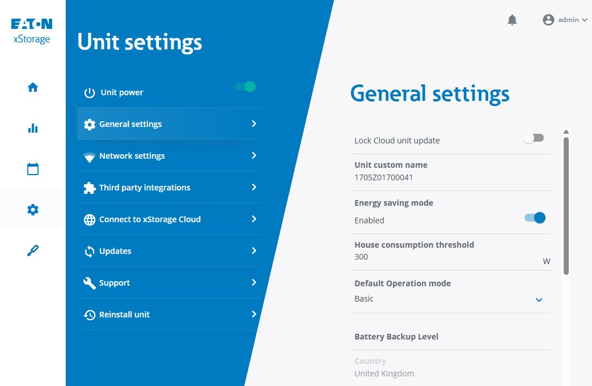
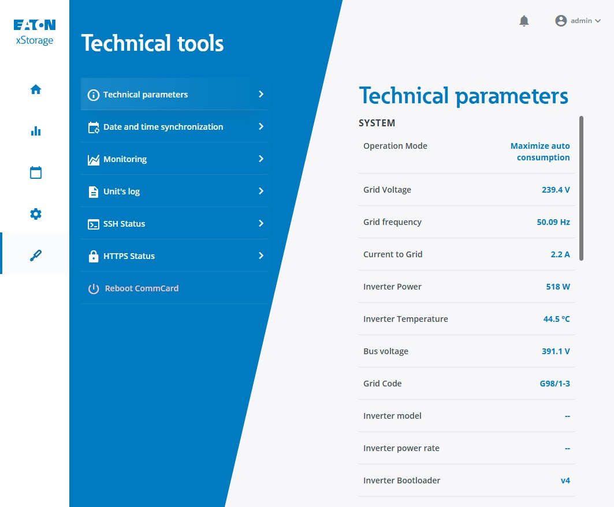

# xStorage Home REST API Documentation

Eaton xStorage Home locally hosted REST HTTPS API Document (Unofficial)

This repository documents discovered API endpoints from an Eaton xStorage Home system, connected to your local network. The endpoints were reverse-engineered using Chrome network monitoring and verified via Postman.

> ⚠️ This project is **not affiliated with or endorsed by Eaton**. Use at your own risk.

---

## Notes

- **Product Status**: This product appears to be end of life. This repository includes an archive of their documentation and encrypted signed firmware for archival purposes.
- **Cloud Service Discontinuation**: ⚠️ **After September 1st, 2025, xStorage Home Cloud (xstoragehome.com) will be disabled permanently**. Remote monitoring capabilities and cloud-based notifications/alerts will no longer be available. Hardware warranty remains unchanged.
- **Data Export Recommendation**: Users should export historical data from the local web interface before cloud shutdown (Charts → Export → CSV download with 5-minute granularity).
- **Firmware Version**: Running firmware version `00.01.0017-0-g72006700`.
- **HTTPS Access**: To avoid certificate errors, access the HTTPS interface via an HTTPS proxy server (e.g., NGINX).
- **SSH Access**: The built-in SSH server (created on-demand) appears to be broken, as evidenced by logs downloadable from the web interface. SSH access is not available.
- **Web Interface**: Screenshots of the web interface are included in this repository for reference.
- **Local Monitoring Alternative**: Home Assistant with community plugins can provide notifications and remote monitoring capabilities after cloud shutdown.
- All endpoints require authentication using Bearer tokens.
- Bearer tokens seem to expire after 60 minutes.
- Some endpoints are restricted to technician profiles and will return a `403 Forbidden` error for customer profiles.

---

## Web Interface Screenshots

The following screenshots show the various pages and functionality of the xStorage Home web interface:

### Dashboard Overview


*Main dashboard showing system status and energy flow*

### System Status


*Detailed system status and battery information*

### Energy Metrics


*Energy consumption and production metrics*

### Device Settings


*Device configuration and settings interface*

### Technical Information


*Technical details and system diagnostics*

---

## Operation Modes Reference

Based on the official Eaton xStorage Home Operation Modes Manual (MN700004EN, April 2019), the following operation modes are available for the xStorage Home system. These modes can be configured via the `/api/device/command` endpoint or through the web interface.

### Mode Priority System

Operation modes follow a priority hierarchy:

1. **Dashboard** - Highest priority (manual override)
2. **Schedule** - Medium priority (scheduled events)
3. **General Settings** - Lowest priority (default mode)

### Manual Operating Modes

Manual modes provide direct control over the system but don't contribute to energy usage optimization:

- **Unit On (Basic Mode)**: `SET_BASIC_MODE` - System converts energy from PV panels
- **Unit Off (Standby)**: System powered down via `/api/device/power` endpoint
- **Charge**: `SET_CHARGE` - Battery pack charging mode
- **Discharge**: `SET_DISCHARGE` - Battery pack discharging mode

### Intelligent Operating Modes

Intelligent modes are designed to maximize solar energy usage and enable cost savings through autonomous operation:

#### 1. Maximize Auto-Consumption (MAC) - `SET_MAXIMIZE_AUTO_CONSUMPTION`

**Purpose**: Maximize utilization of PV-generated energy and minimize grid consumption.

**Operation**:

- Charges battery from excess PV energy during the day
- Discharges battery to power loads when PV is insufficient
- Stores energy for use during evening hours when electricity prices are higher

**Requirements**:

- AC Coupled: Both power meters required for full optimization
- DC Coupled: Power Meter 1 required with separated critical/non-critical loads
- NO-PV: Not applicable

**Use Case**: Ideal for installations with PV panels where the goal is self-sufficiency.

#### 2. Peak Shaving - `SET_PEAK_SHAVING`

**Purpose**: Avoid penalty charges by preventing household consumption from exceeding contracted maximum peak power.

**Parameters**:

- `maxHousePeakConsumption`: Maximum allowed household power consumption (Watts)

**Operation**:

- Monitors total household consumption continuously
- Automatically discharges battery when consumption exceeds threshold
- Stops discharging when consumption falls below threshold
- Can be combined with scheduled charging during low-tariff periods

**Requirements**: Power Meter 1 must be installed for all installation types

**Use Case**: Households with utility contracts that penalize peak consumption above contracted limits.

#### 3. Variable Grid Injection - `SET_VARIABLE_GRID_INJECTION`

**Purpose**: Control the amount of surplus PV energy injected back into the grid.

**Parameters**:

- `maximumPower`: Grid injection limit (-1000W to +3000W)
  - Positive values: Maximum power injection to grid
  - Negative values: Minimum power consumption from grid

**Operation**:

- Powers loads with PV energy first
- Charges battery with surplus PV energy
- Limits grid injection to specified maximum when battery is full
- Prevents penalties from utilities that charge for grid injection

**Requirements**: Power Meter 1 must be installed for all installation types

**Use Case**: Areas where utilities penalize or limit grid injection of surplus solar energy.

#### 4. Frequency Regulation - `SET_FREQUENCY_REGULATION`

**Purpose**: Provide grid frequency stabilization services to utilities or aggregators.

**Parameters**:

- `powerAllocation`: Power available for grid regulation (Watts)
- `optimalSoc`: Target State of Charge for optimal regulation capacity (0-100%)

**Operation**:

- Injects power to grid when frequency drops (e.g., below 50Hz in Europe)
- Absorbs power from grid when frequency rises (e.g., above 50Hz in Europe)
- Maintains optimal SOC for maximum up/down regulation capacity
- User receives remuneration for frequency stabilization services

**Requirements**:

- No power meter required (system senses grid frequency automatically)
- Critical loads cannot be connected when this mode is active
- Not available for 6kW hybrid inverter systems

**Use Case**: Commercial arrangements with utilities for grid stabilization services.

### Installation Type Compatibility

| Operation Mode | AC Coupled | DC Coupled | NO-PV |
|---|---|---|---|
| Manual Modes | ✅ All | ✅ All | ✅ All |
| Maximize Auto-Consumption | ✅ Both meters | ✅ Meter 1 + load separation | ❌ Not applicable |
| Peak Shaving | ✅ Meter 1 | ✅ Meter 1 | ✅ Meter 1 |
| Variable Grid Injection | ✅ Meter 1 | ✅ Meter 1 | ✅ Meter 1 |
| Frequency Regulation | ✅ No specific requirements | ✅ No specific requirements | ✅ No specific requirements |

**Note**: Some operation modes may not be available in all countries due to local installation codes and regulations.

---

## Technical System Information

Based on the official Eaton xStorage Home Installation Manual (MN700001EN, April 2019), the following technical information provides context for API responses and system behavior.

### Battery Backup Level (`bmsBackupLevel`)

The Battery Backup Level represents the minimum State of Charge (SOC) reserved for backup power during grid outages. This parameter appears in several API responses:

- **Purpose**: Ensures sufficient battery capacity is always available for critical loads during power outages
- **Range**: 0-100%
- **Configuration**: Can be updated via `/api/settings/` endpoint in the `bmsBackupLevel` parameter
- **Impact**: When set above 0%, the battery will not discharge below this level during normal operation

### System Capacity Configurations

The xStorage Home system is available in multiple configurations, all visible in API responses:

| Charging Power | Battery Capacity | Part Number Example |
|---|---|---|
| 3.6 kW | 4.2 kWh | XSTH1P0361UBUEV2 |
| 4.6 kW | 4.2 kWh | XSTH1P0461UBUEV2 |
| 6.0 kW | 4.2 kWh | XSTH1P0601UBUEV2 |
| 3.6 kW | 6.0 kWh | XSTH1P0362NBUEV2 |
| 4.6 kW | 6.0 kWh | XSTH1P0462NBUEV2 |
| 6.0 kW | 6.0 kWh | XSTH1P0602NBUEV2 |
| 3.6 kW | 10.08 kWh | XSTH1P0364NBUEV2 |
| 4.6 kW | 10.08 kWh | XSTH1P0464NBUEV2 |
| 6.0 kW | 10.08 kWh | XSTH1P0604NBUEV2 |

### Installation Types and Power Meter Requirements

Understanding your installation type helps interpret API data:

#### AC Coupled Installation

- **Characteristics**: Existing PV system connected via AC distribution box
- **API Indicators**: `powerMeters` array shows configured meters, `hasPv: false` (PV connected separately)
- **Power Meter Requirements**: Both Power Meter 1 and 2 needed for full energy monitoring

#### DC Coupled Installation

- **Characteristics**: PV panels connected directly to hybrid inverter via MC4 connectors
- **API Indicators**: `hasPv: true`, PV values appear in `/api/technical/status`
- **Power Meter Requirements**: Power Meter 1 required for household consumption monitoring

#### NO-PV Installation

- **Characteristics**: Battery system only, no solar panels
- **API Indicators**: `hasPv: false`, PV values show 0 in all responses
- **Power Meter Requirements**: Power Meter 1 for household monitoring (optional but recommended)

### Critical vs Non-Critical Loads

The system distinguishes between two types of electrical loads:

- **Critical Loads**: Powered by battery during grid outages (connected to AC Load Output)
- **Non-Critical Loads**: Not powered during outages (connected directly to grid)

This distinction affects energy flow calculations in `/api/device/status` responses.

### Battery Management System (BMS) Information

Key BMS parameters visible in API responses:

- **`bmsFirmwareVersion`**: Battery management firmware (e.g., "4004")
- **`bmsCapacity`**: Total battery capacity in kWh (e.g., 4.2)
- **`bmsSerialNumber`**: Unique battery identifier
- **`bmsModel`**: Battery model designation (e.g., "RESIDENCIAL")
- **`bmsState`**: Current battery state ("BAT_CHARGING", "BAT_DISCHARGING", "BAT_IDLE")
- **`bmsAvgTemperature`**: Average battery temperature for thermal management

### Operational Limits and Safety

#### Temperature Management

- **Operating Range**: 0°C to 30°C (32°F to 86°F)
- **Maximum Duration**: Cannot exceed 30°C for more than 10 consecutive days
- **Impact**: System may reduce performance or shut down if temperature limits exceeded

#### Power Limitations

- **Grid Code**: Determines operational parameters (visible in `/api/technical/status` as `gridCode`)
- **Maximum Current**: 35A for DC input (Isc)
- **Voltage Ranges**: Monitored continuously for safety

#### Emergency Features

- **Emergency Power Off (EPO)**: Can be triggered via hardware button
- **Automatic Shutdowns**: System protects itself from overvoltage, undervoltage, and temperature extremes
- **Residual Current Monitoring**: Built-in ground fault protection

### Energy Flow Terminology

Understanding energy flow terms in API responses:

- **`gridRole`**: Direction of grid power flow ("NONE", "SUPPLYING", "CONSUMING")
- **`batteryEnergyFlow`**: Positive = discharging, Negative = charging
- **`operationMode`**: Current system operation ("CHARGING", "DISCHARGING", "IDLE")
- **`selfConsumption`**: Percentage of generated energy used directly
- **`selfSufficiency`**: Percentage of energy needs met by local generation

### Troubleshooting Context

Common system states and their meanings:

- **"No Utility"**: Grid connection lost or AC breaker open
- **"No Battery"**: Battery communication or connection issue
- **"Checking"**: System performing grid connection verification
- **"Normal"**: System operating correctly and connected to grid

This technical context helps interpret API responses and understand system behavior during different operating conditions.

---

## Data Export and Monitoring Alternatives

### Historical Data Export

⚠️ **Important**: With xStorage Home Cloud shutting down on September 1st, 2025, it's crucial to export your historical data before this date.

**How to Export Data via Web Interface:**

1. **Access Charts**: Navigate to the Charts section (chart icon) in the left sidebar of the web interface
2. **Export Function**: Click the Export icon on the right side of the screen
3. **Configure Export**:
   - Set Export start date and end date using the date picker
   - Granularity is fixed at 5-minute intervals (cannot be changed)
   - Select which data types to export from the available options
4. **Download**: Click Export Button to download a CSV file to your device

**Data Export Options Available:**

- Battery State of Charge
- Energy consumption and production metrics
- Grid injection/consumption data
- PV generation data (if applicable)
- System operational data

### Post-Cloud Monitoring Alternatives

After cloud service discontinuation, users have several options for continued monitoring:

#### Local Web Interface

- Access via device IP address: `https://[device-ip]`
- All API endpoints documented in this repository remain functional
- Real-time monitoring and system control available

#### Home Assistant Integration

- Community plugins available for xStorage Home integration
- Provides notifications and remote monitoring capabilities
- Replaces cloud-based alerting functionality
- Custom dashboards and automation possible

#### Custom API Integration

- Use the documented REST API endpoints for custom monitoring solutions
- Build your own monitoring dashboard or mobile app
- Integrate with existing home automation systems

### Default Credentials Reminder

If you can't access your system:

- **Customer Account**: Username: `user`, Password: `user`
- **Technician Account**: Username: `admin`, Password: `jlwgK41G`

---

## License & Legal

This documentation is provided for educational, research, and interoperability purposes only. The API endpoints documented here were discovered through legitimate reverse engineering techniques for personal use with owned hardware.

### MIT License

Copyright (c) 2025 genestealer

Permission is hereby granted, free of charge, to any person obtaining a copy
of this documentation and associated files (the "Documentation"), to deal
in the Documentation without restriction, including without limitation the rights
to use, copy, modify, merge, publish, distribute, sublicense, and/or sell
copies of the Documentation, and to permit persons to whom the Documentation is
furnished to do so, subject to the following conditions:

The above copyright notice and this permission notice shall be included in all
copies or substantial portions of the Documentation.

THE DOCUMENTATION IS PROVIDED "AS IS", WITHOUT WARRANTY OF ANY KIND, EXPRESS OR
IMPLIED, INCLUDING BUT NOT LIMITED TO THE WARRANTIES OF MERCHANTABILITY,
FITNESS FOR A PARTICULAR PURPOSE AND NONINFRINGEMENT. IN NO EVENT SHALL THE
AUTHORS OR COPYRIGHT HOLDERS BE LIABLE FOR ANY CLAIM, DAMAGES OR OTHER
LIABILITY, WHETHER IN AN ACTION OF CONTRACT, TORT OR OTHERWISE, ARISING FROM,
OUT OF OR IN CONNECTION WITH THE DOCUMENTATION OR THE USE OR OTHER DEALINGS IN THE
DOCUMENTATION.

### Additional Disclaimers

- API endpoint documentation: Licensed under MIT as above
- Firmware files: Archived for preservation purposes only - all rights remain with Eaton Corporation
- This project claims no ownership over Eaton's intellectual property
- Eaton® and xStorage Home® are trademarks of Eaton Corporation

---

## To-Do List

1. ~~SSH into the controller and look for more endpoints.~~ (SSH server is broken - see Notes)
2. ~~Review the provided operation modes manual for detailed mode descriptions.~~ (Completed - see Operation Modes Reference section)
3. Review the provided top-level firmware specification for the controller for more information.

---

## Summary Table

| Endpoint                          | Method | Requires Technician Account | Description                       |
|-----------------------------------|--------|-----------------------------|-----------------------------------|
| `/api/config/state`               | GET    | No                          | Retrieves the current configuration state of the system. |
| `/api/device`                     | GET    | No                          | Retrieves device information.     |
| `/api/device/status`              | GET    | No                          | Retrieves the current status of the device. |
| `/api/settings`                   | GET    | No                          | Retrieves device settings.        |
| `/api/metrics`                    | GET    | No                          | Retrieves hourly metrics data.    |
| `/api/metrics/daily`              | GET    | No                          | Retrieves daily metrics data.     |
| `/api/schedule/`                  | GET    | No                          | Retrieves schedule information.   |
| `/api/notifications/`             | GET    | No                          | Retrieves device notifications and alerts. |
| `/api/notifications/unread`       | GET    | No                          | Retrieves count of unread notifications. |
| `/api/notifications/read/all`     | POST   | No                          | Marks all notifications as read. |
| `/api/technical/status`           | GET    | Yes                         | Retrieves technical status of the device. |
| `/api/device/maintenance/diagnostics` | GET | Yes                         | Retrieves maintenance diagnostics. |
| `/api/device/command`             | POST   | No                          | Sends commands to the device.     |
| `/api/device/power`               | POST   | No                          | Controls the power state of the device (on/off). |
| `/api/settings/`                  | PUT    | No                          | Updates device settings including energy saving mode. |
| `/api/auth/signin`                | POST   | No                          | Authenticates a user and retrieves a token. |

---

## API Endpoints

### General Endpoints

#### `GET /api/config/state`

- **Description**: Retrieves the current configuration state of the system.
- **Response**:

  ```json
  {
    "setupComplete": true,
    "missingSteps": [],
    "version": "00.01.0017-0-g72006700",
    "onboardState": "not_onboarded",
    "onboard": {
      "onboardedBy": {
        "name": " ",
        "email": ""
      },
      "onboardedAt": -62135596800,
      "techEmail": ""
    },
    "connected": false
  }
  ```

- **Comment**: Not much useful information.

#### `GET /api/device`

- **Description**: Retrieves device information.
- **Response**:

  ```json
  {
      "successful": true,
      "message": "Content Ready",
      "result": {
          "id": "",
          "updatedAt": 1752441080,
          "createdAt": 1752441080,
          "name": "REDACTED",
          "description": "",
          "address": "",
          "country": {
              "geonameId": "2635167",
              "name": "United Kingdom"
          },
          "city": {
              "geonameId": "2649833",
              "name": "London"
          },
          "postalCode": "",
          "latitude": 0,
          "longitude": 0,
          "firmwareVersion": "00.01.0017-0-g72006700",
          "commCardFirmwareVersion": "",
          "timezone": {
              "id": "Europe/London",
              "updatedAt": 0,
              "createdAt": 0,
              "timezone": "Europe/London",
              "countryId": "",
              "name": "Europe/London",
              "version": ""
          },
          "dns": "8.8.8.8",
          "bmsCapacity": 4.2,
          "bmsFirmwareVersion": "4004",
          "bmsBackupLevel": 0,
          "bmsSerialNumber": "REDACTED",
          "bmsModel": "RESIDENCIAL",
          "bmsAvgTemperature": 0,
          "inverterManufacturer": "EATON",
          "inverterModelName": "XSTH1P036P048V01",
          "inverterVaRating": 3600,
          "inverterNominalVpv": 3600,
          "inverterIsSinglePhase": true,
          "inverterFirmwareVersion": "00.06.0069",
          "inverterSerialNumber": "REDACTED",
          "networkInterfaces": [
              {
                  "id": "",
                  "updatedAt": 0,
                  "createdAt": 0,
                  "name": "eth0",
                  "macAddress": "00:20:85:f2:00:35",
                  "ipAddress": "192.168.3.35"
              },
              {
                  "id": "",
                  "updatedAt": 0,
                  "createdAt": 0,
                  "name": "wlan0",
                  "macAddress": "74:da:38:99:5a:b5",
                  "ipAddress": "192.168.3.52"
              }
          ],
          "powerMeters": [
              {
                  "id": "",
                  "updatedAt": 0,
                  "createdAt": 0,
                  "position": 1,
                  "model": "None",
                  "singlePhase": true
              },
              {
                  "id": "",
                  "updatedAt": 0,
                  "createdAt": 0,
                  "position": 2,
                  "model": "None",
                  "singlePhase": true
              }
          ],
          "hasPv": false,
          "hasBattery": true,
          "powerState": true,
          "connected": false,
          "deviceLastScheduleUpdate": 1752544607,
          "deviceLastUpdate": 1752441080,
          "updateStatus": "",
          "updateBlockedState": false,
          "bundleVersion": "v1.17",
          "localPortalRemoteId": "47221",
          "energySavingMode": {
              "enabled": true,
              "houseConsumptionThreshold": 300
          }
      }
  }

  ```

- **Comment**: Lots of good information.

#### `GET /api/device/status`

- **Description**: Retrieves the current status of the device.
- **Response**:

  ```json
  {
      "successful": true,
      "message": "Content Ready",
      "result": {
          "currentMode": {
              "id": "4c773998-fdc8-4faf-8132-847c27d10eb6",
              "command": "SET_CHARGE",
              "createdAt": 1752584987000,
              "updatedAt": 1752584987000,
              "duration": 1,
              "startTime": 1409,
              "endTime": 1509,
              "recurrence": "MANUAL_EVENT",
              "type": "MANUAL",
              "parameters": {
                  "action": "ACTION_CHARGE",
                  "power": 15,
                  "soc": 90
              },
              "user": {
                  "id": "00000000-0000-0000-0000-000000000000",
                  "firstName": "Local",
                  "lastName": "User"
              }
          },
          "energyFlow": {
              "acPvRole": "DISCONNECTED",
              "acPvValue": 0,
              "batteryBackupLevel": 0,
              "batteryStatus": "BAT_CHARGING",
              "batteryEnergyFlow": 406,
              "criticalLoadRole": "NONE",
              "criticalLoadValue": 0,
              "dcPvRole": "DISCONNECTED",
              "dcPvValue": 0,
              "gridRole": "NONE",
              "gridValue": 0,
              "nonCriticalLoadRole": "NONE",
              "nonCriticalLoadValue": 0,
              "operationMode": "CHARGING",
              "selfConsumption": 0,
              "selfSufficiency": 0,
              "stateOfCharge": 88,
              "energySavingModeEnabled": true,
              "energySavingModeActivated": false
          },
          "last30daysEnergyFlow": {
              "gridConsumption": 0,
              "photovoltaicProduction": 0,
              "selfConsumption": 0,
              "selfSufficiency": 0
          },
          "today": {
              "gridConsumption": 0,
              "photovoltaicProduction": 0,
              "selfConsumption": 0,
              "selfSufficiency": 0
          }
      }
  }

  ```

- **Comment**: Lots of good information.

#### `GET /api/settings`

- **Description**: Retrieves device settings.
- **Response**:

  ```json
  {
      "successful": true,
      "message": "Content Ready",
      "result": {
          "id": "990e5920-246f-4768-b31c-121b9149108a",
          "updatedAt": 1752441080,
          "createdAt": 1752441080,
          "name": "REDACTED",
          "description": "",
          "hasPv": false,
          "hasBattery": true,
          "address": "",
          "country": {
              "geonameId": "2635167",
              "name": "United Kingdom"
          },
          "city": {
              "geonameId": "2649833",
              "name": "London"
          },
          "postalCode": "",
          "latitude": 0,
          "longitude": 0,
          "defaultMode": {
              "id": "8870c322-0f3d-4d7f-a701-b664da32448c",
              "updatedAt": 1752284944,
              "createdAt": 1752284944,
              "user": null,
              "command": "SET_BASIC_MODE",
              "parameters": null
          },
          "firmwareVersion": "00.01.0017-0-g72006700",
          "bmsSerialNumber": "H-B60-H-41-031",
          "commCardFirmwareVersion": "",
          "inverterFirmwareVersion": "00.06.0069",
          "inverterSerialNumber": "REDACTED",
          "inverterPowerRating": 0,
          "bmsFirmwareVersion": "4004",
          "bmsBackupLevel": 0,
          "timezone": {
              "id": "Europe/London",
              "updatedAt": 0,
              "createdAt": 0,
              "timezone": "Europe/London",
              "countryId": "",
              "name": "Europe/London",
              "version": ""
          },
          "dns": "8.8.8.8",
          "inverterIsSinglePhase": true,
          "bmsCapacity": 4.2,
          "networkInterfaces": [
              {
                  "id": "",
                  "updatedAt": 0,
                  "createdAt": 0,
                  "name": "eth0",
                  "macAddress": "00:20:85:f2:00:35",
                  "ipAddress": "192.168.3.35"
              },
              {
                  "id": "",
                  "updatedAt": 0,
                  "createdAt": 0,
                  "name": "wlan0",
                  "macAddress": "74:da:38:99:5a:b5",
                  "ipAddress": "192.168.3.52"
              }
          ],
          "powerMeters": [
              {
                  "id": "",
                  "updatedAt": 0,
                  "createdAt": 0,
                  "position": 1,
                  "model": "None",
                  "singlePhase": true
              },
              {
                  "id": "",
                  "updatedAt": 0,
                  "createdAt": 0,
                  "position": 2,
                  "model": "None",
                  "singlePhase": true
              }
          ],
          "updateBlockedState": false,
          "bundleVersion": "v1.17",
          "localPortalRemoteId": "47221",
          "energySavingMode": {
              "enabled": true,
              "houseConsumptionThreshold": 300
          }
      }
  }

  ```

- **Comment**: Lots of good information.

#### `PUT /api/settings/`

- **Description**: Updates device settings including energy saving mode configuration.
- **Request**:

  ```json
  {
    "settings": {
      "name": "1705Z01700041",
      "country": "2635167",
      "timezone": "Europe/London",
      "city": "2649833",
      "postalCode": "",
      "bmsBackupLevel": 0,
      "updateBlockedState": false,
      "defaultMode": {
        "command": "SET_BASIC_MODE",
        "parameters": {}
      },
      "energySavingMode": {
        "enabled": false,
        "houseConsumptionThreshold": 300
      }
    }
  }
  ```

  - **energySavingMode.enabled**: Boolean value to enable/disable energy saving mode.
  - **energySavingMode.houseConsumptionThreshold**: Integer value between 300W and 1000W for the house consumption threshold.

- **Response**:

  ```json
  {
    "successful": true,
    "message": "Successfully updated",
    "result": null
  }
  ```

- **Comment**: Updates various device settings. The energy saving mode can be toggled on/off and the house consumption threshold can be adjusted within the 300-1000W range.

---

### Metrics Endpoints

#### `GET /api/metrics`

- **Description**: Retrieves hourly metrics data.
- **Response**:

  ```json
  {
    "metrics": [
      { "batteryStateOfCharge": 6, "time": 1752534000000 },
      { "batteryStateOfCharge": 7, "time": 1752534300000 }
    ],
    "total": { "batteryStateOfCharge": 52 }
  }
  ```

- **Comment**: Day metrics (shows data by the hour).

#### `GET /api/metrics/daily`

- **Description**: Retrieves daily metrics data.
- **Response**:

  ```json
  {
    "metrics": [
      { "batteryStateOfCharge": 64, "time": 1752447600000 }
    ],
    "total": { "batteryStateOfCharge": 64 }
  }
  ```

- **Comment**: Week metrics (shows data by the day).

---

### Notifications Endpoints

#### `GET /api/notifications/`

- **Description**: Retrieves device notifications and alerts.
- **Query Parameters**:
  - **status**: Filter by notification status (e.g., "NORMAL", "READ")
  - **size**: Number of results to return (e.g., 4)
  - **offset**: Starting position for pagination (e.g., 0)

- **Response**:

  ```json
  {
    "successful": true,
    "message": "Content Ready",
    "result": {
      "total": 5,
      "start": 0,
      "sort": "",
      "order": "",
      "size": 4,
      "results": [
        {
          "updatedAt": 1753485589000,
          "createdAt": 1753467646000,
          "alertId": "35eefa26-ea2f-4ef4-a96f-6611fbfede75",
          "previousAlertId": "377efe13-a5fb-4b03-ac33-66e982060c98",
          "level": "INFO",
          "type": "DEVICES",
          "subType": "BATTERY_VOLTAGE_LOW",
          "status": "READ"
        },
        {
          "updatedAt": 1753485589000,
          "createdAt": 1753467340000,
          "alertId": "377efe13-a5fb-4b03-ac33-66e982060c98",
          "previousAlertId": "",
          "level": "CRITICAL",
          "type": "DEVICES",
          "subType": "BATTERY_VOLTAGE_LOW",
          "status": "READ"
        },
        {
          "updatedAt": 1752545790000,
          "createdAt": 1752506923000,
          "alertId": "386cf39c-4d18-469b-a778-20f4ed0ffecc",
          "previousAlertId": "7de50ceb-8a8f-48b9-ac55-234564eb75b1",
          "level": "INFO",
          "type": "DEVICES",
          "subType": "BATTERY_VOLTAGE_HIGH",
          "status": "READ"
        },
        {
          "updatedAt": 1752545790000,
          "createdAt": 1752489067000,
          "alertId": "7de50ceb-8a8f-48b9-ac55-234564eb75b1",
          "previousAlertId": "",
          "level": "CRITICAL",
          "type": "DEVICES",
          "subType": "BATTERY_VOLTAGE_HIGH",
          "status": "READ"
        }
      ]
    }
  }
  ```

- **Comment**: Returns notifications and alerts with severity levels (INFO, CRITICAL) and battery-related subtypes. Supports pagination and filtering.

#### `GET /api/notifications/unread`

- **Description**: Retrieves count of unread notifications.
- **Query Parameters**:
  - **status**: Filter by notification status (e.g., "NORMAL")

- **Response**:

  ```json
  {
    "successful": true,
    "message": "Content Ready",
    "result": {
      "total": 0
    }
  }
  ```

- **Comment**: Returns the total count of unread notifications. Useful for displaying notification badges or counts in the UI.

#### `POST /api/notifications/read/all`

- **Description**: Marks all notifications as read.
- **Request**: No body required (content-length: 0).
- **Response**:

  ```json
  {
    "successful": true,
    "message": "Successfully updated",
    "result": null
  }
  ```

- **Comment**: Simple endpoint to mark all notifications as read. Returns a success confirmation message.

---

### Command Endpoints

#### `POST /api/device/command`

Commands control the operational mode of the xStorage Home system. Each command follows the priority hierarchy: Dashboard > Schedule > General Settings. See the Operation Modes Reference section above for detailed explanations of each mode.

**Common Parameters for all commands:**

- `duration`: Number of hours for the command to run (integer from 1 to 12)

---

**Manual Operating Modes:**

- **SET_BASIC_MODE**: Sets the device to basic/idle mode (Unit On)

  ```json
  { "command": "SET_BASIC_MODE", "duration": 2, "parameters": null }
  ```

  *Brings the system into basic mode where it can convert energy from PV panels but operates without intelligent optimization.*

- **SET_CHARGE**: Sets the device to manual charge mode

  ```json
  { "command": "SET_CHARGE", "duration": 2, "parameters": { "power": 10, "soc": 90, "action": "ACTION_CHARGE" } }
  ```

  - **Power**: Integer value between 5–100% (charging power percentage)
  - **SOC**: Target State of Charge (0–100%) in 1% steps; UI only allows steps of 5%
  - **Action**: Must be "ACTION_CHARGE" for charging mode

  *Forces the battery to charge, either from PV or grid depending on availability.*

- **SET_DISCHARGE**: Sets the device to manual discharge mode

  ```json
  { "command": "SET_DISCHARGE", "duration": 2, "parameters": { "power": 5, "soc": 10, "action": "ACTION_DISCHARGE" } }
  ```

  - **Power**: Integer value between 5–100% (discharge power percentage)
  - **SOC**: Target State of Charge (0–100%) in 1% steps; UI only allows steps of 5%
  - **Action**: Must be "ACTION_DISCHARGE" for discharge mode

  *Forces the battery to discharge to power loads or inject power to grid.*

---

**Intelligent Operating Modes:**

- **SET_MAXIMIZE_AUTO_CONSUMPTION**: Maximize Auto-Consumption (MAC) mode

  ```json
  { "command": "SET_MAXIMIZE_AUTO_CONSUMPTION", "duration": 2, "parameters": null }
  ```

  *Optimizes PV energy usage by charging battery with excess solar energy and discharging when PV is insufficient. Requires proper power meter configuration for full optimization.*

- **SET_VARIABLE_GRID_INJECTION**: Variable grid injection mode

  ```json
  { "command": "SET_VARIABLE_GRID_INJECTION", "duration": 2, "parameters": { "maximumPower": 0 } }
  ```

  - **maximumPower**: Grid injection limit in Watts (-1000 to +3000)
    - Positive: Maximum power injection to grid
    - Negative: Minimum power consumption from grid

  *Controls surplus PV energy injection to prevent utility penalties. Powers loads first, charges battery second, then limits grid injection to specified maximum.*

- **SET_FREQUENCY_REGULATION**: Frequency regulation mode for grid stabilization

  ```json
  { "command": "SET_FREQUENCY_REGULATION", "duration": 2, "parameters": { "powerAllocation": 0, "optimalSoc": 0 } }
  ```

  - **powerAllocation**: Power available for grid regulation in Watts
  - **optimalSoc**: Target State of Charge for optimal regulation capacity (0-100%)

  *Provides grid frequency stabilization services. Injects/absorbs power based on grid frequency. Requires commercial arrangement with utility/aggregator. Not available for 6kW inverters.*

- **SET_PEAK_SHAVING**: Peak shaving mode

  ```json
  { "command": "SET_PEAK_SHAVING", "duration": 2, "parameters": { "maxHousePeakConsumption": 0 } }
  ```

  - **maxHousePeakConsumption**: Maximum allowed household consumption in Watts

  *Prevents household consumption from exceeding contracted peak power limits. Automatically discharges battery when consumption threshold is exceeded to avoid utility penalties.*

---

### Power Control Endpoints

#### `POST /api/device/power`

- **Description**: Controls the power state of the device (on/off).
- **Request**:

  ```json
  {
    "parameters": {
      "state": false
    }
  }
  ```

  - **state**: Boolean value to control power state (true = on, false = off).

- **Comment**: When the device is turned off, the "powerState" field in other API responses will return false.

---

### Authentication Endpoints

#### `POST /api/auth/signin`

- **Description**: Authenticates a user and retrieves a token.
- **Default Credentials**: If you've forgotten your credentials, try the default ones:
  - **Customer**: Username: `user`, Password: `user`
  - **Technician**: Username: `admin`, Password: `jlwgK41G`
- **Request**:
  - **Technician**:

    ```json
    {
      "username": "admin",
      "pwd": "jlwgK41G",
      "inverterSn": "REDACTED",
      "email": "anything@anything.com",
      "userType": "tech"
    }
    ```

    - **Note**: When signing in with the Technician account, the email address can be anything.
  - **Customer**:

    ```json
    {
      "username": "user",
      "pwd": "user",
      "userType": "customer"
    }
    ```

- **Response**:

  ```json
  {
    "": "eyJhbGciOiJIUzI1NiIsInR5cCI6IkpXVCJ9..."
  }
  ```

---

### Technical Status Endpoint

#### `GET /api/technical/status`

- **Description**: Retrieves technical status of the device.
- **Note**: Requires technician login; customer accounts will receive a 403 Forbidden error.

- **Response**:

  ```json
  {
    "successful": true,
    "message": "Content Ready",
    "result": {
      "operationMode": "CHARGING",
      "gridVoltage": 241.40001,
      "gridFrequency": 49.96,
      "currentToGrid": 0.90000004,
      "inverterPower": 0,
      "inverterTemperature": 43.4,
      "busVoltage": 393.7,
      "gridCode": "UK_G98",
      "dcCurrentInjectionR": 0,
      "dcCurrentInjectionS": 0,
      "dcCurrentInjectionT": 0,
      "inverterModel": "XSTH1P036P048V01",
      "inverterPowerRating": 0,
      "pv1Voltage": 0,
      "pv1Current": 0,
      "pv2Voltage": 0,
      "pv2Current": 0,
      "bmsVoltage": 98.6,
      "bmsCurrent": 0.42000002,
      "bmsTemperature": 34.3,
      "bmsAvgTemperature": 0,
      "bmsMaxTemperature": 35.5,
      "bmsMinTemperature": 32.8,
      "bmsTotalCharge": 206,
      "bmsTotalDischarge": 143,
      "bmsStateOfCharge": 90,
      "bmsState": "BAT_IDLE",
      "bmsFaultCode": null,
      "bmsHighestCellVoltage": 4119,
      "bmsLowestCellVoltage": 4101,
      "tidaProtocolVersion": "",
      "invBootloaderVersion": "04.00",
      "meters": null
    }
  }
  ```

- **Comment**: Returns technical status including grid, inverter, and battery metrics.

#### `GET /api/device/maintenance/diagnostics`

- **Description**: Retrieves maintenance diagnostics.
- **Note**: Requires technician login; customer accounts will receive a 403 Forbidden error.

- **Response**:

  ```json
  {
    "successful": true,
    "message": "Content Ready",
    "result": {
      "updatedAt": 1752591465,
      "createdAt": 1752591465,
      "diskUsage": {
        "updatedAt": 1752591412,
        "createdAt": 69,
        "partition": [
          {
            "name": "/",
            "free": 336388096,
            "used": 150028288,
            "size": 486416384
          },
          {
            "name": "/mnt/DB",
            "free": 427753472,
            "used": 14790656,
            "size": 447496192
          }
        ]
      },
      "ramUsage": {
        "updatedAt": 1752591412,
        "createdAt": 69,
        "total": 120078336,
        "used": 30228480
      },
      "cpuUsage": {
        "updatedAt": 1752591412,
        "createdAt": 69,
        "used": 6.125211505924395
      }
    }
  }
  ```

- **Comment**: Returns system diagnostics including disk, RAM, and CPU usage.
